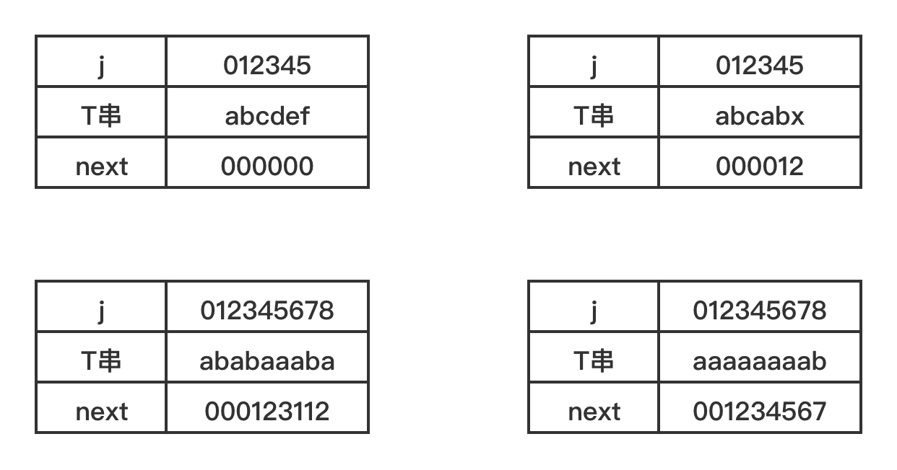

## KMP模式匹配算法
KMP模式匹配算法([code](KMPString.java))是旨在对存在大量重复元素或者循环的字符串的匹配时，减少匹配次数。

规定需要匹配的主串为S串，长度为n;子串为T串，长度为m。

KMP模式匹配算法的核心是，在执行匹配循环前，先分析T串结构，确定一个next数据来标记下一次循环开始时可跳跃的匹配次数。举例说明：

KMP模式匹配算法时间复杂度为O(n+m),相对于朴素模式匹配算法的O((n-m+1)*n)有了不错的提示，但值得注意的是，
只有当主串S串和子串T串有比较多的'部分匹配'的情况，KMP模式才有比较明显的优势。

另外，目前实现的KMP匹配算法仍有优化空间。比如例子4，子串为"aaaaaaaab"时，当前8位出现匹配失败时，仍然会一位一位的去移动比较。
但其实他们的值都一致，且地位相等，完全可以直接跳到第一位继续匹配（即用next(1)去代替与它相等字符的next值，这个数组定义为nextval）。

---
Ps：书中采取存next及nextval数组的结构为首位存长度，数据从1开始，而我在用java实现时，替换为从0开始存数据，因此代码会略有不同，最后获得的next及nextval数组的值也会减一。
