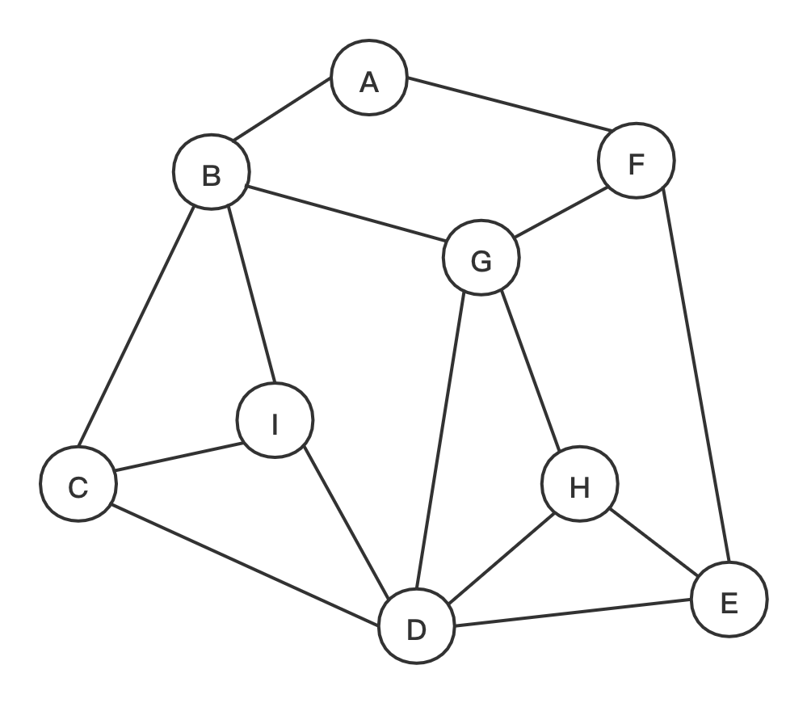

## 图

#### 图的定义
图(Graph)是由顶点的有穷非空集合和顶点之间边的集合组成，通常表示为:G(V,E)，其中G表示一个图，
V是图G中顶点的集合，E是图G中边的集合。

相关概念：
- **图**按照有无方向分为**无向图**和**有向图**。无向图由**顶点**和**边**构成，有向图由**顶点**和**弧**构成。弧有**弧尾**和**弧头**之分。
- 图按照边或者弧的多少分**稀疏图**和**稠密图**，如果任意两个顶点之间都存在边叫**完全图**，有向的叫**有向完全图**。
若无重复的边或顶点到自身的边则叫**简单图**。
- 图中顶点之间有**邻接点**、**依附**的概念。无向图顶点的边数叫做**度**，有向图顶点分为**入度**和**出度**。
- 图上的边或弧上带**权**则称为**网**。
- 图中顶点间存在**路径**，两顶点存在路径则说明是**连通**的，如果路径最终回到起始点则称为**环**，当中不重复叫**简单路径**。
若任意两顶点都是连通的，则图就是**连通图**，有向则称为**强连通图**。图中有子图，若子图极大连通则就是**连通分量**，有向的则称**强连通分量**。
- 无向图中连通且n个顶点n-1条边叫**生成树**。有向图中一顶点入度为0其余顶点入度为1的叫**有向树**。一个有向图由若干棵有向树构成**森林**。
#### 图的存储结构
#### *图的遍历
#### *最小生成树
#### *最短路径
#### 拓扑排序
#### 关键路径
#### *并查集