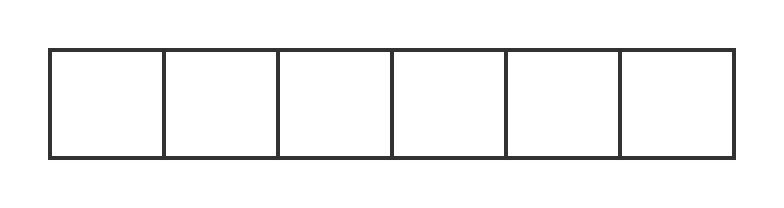
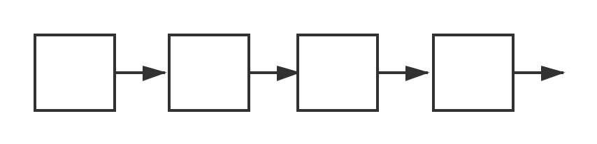

## 线性表
线性表(List):零个或者等多个数据元素的有限序列。`---java.util.List`

#### 线性表的顺序存储结构
线性表的顺序存储结构，指的是用一段地址连续的存储单元依次存储线性表的数据元素。`---ArrayList`

**优点：**

1、无需为表示线性表中元素之间的逻辑关系而增加额外的存储空间

2、可以快速地存取表中任意位置的元素 `---随机访问，java中标志接口 RandomAccess`

**缺点：**

1、插入和删除操作需要移动大量元素

2、当线性表长度变化较大时，难以确定存储空间的容量`---这一部分java工具包默认实现了自动扩容，可以不指定容量`
#### 线性表的链式存储结构
线性表的链式存储结构，指的是用链表来储存线性表的数据元素。`---LinkedList`

 - 单链表： 最基础的链表
 - 静态链表：使用数组存储链表，使用数据下标实现节点后驱，这个方法又称游标实现法
 - 循环链表：终端节点的后驱由空改为指向头结点
 - 双向链表：每个节点增加前驱域

**优点：**

1、使用链表来存储，不需要分配存储空间，只要有就可以分配，元素个数也不受限制

2、插入和删除性能（链表为O(1)，顺序存储为O(n)）

**缺点：**

1、查找性能（链表为O(n)，顺序存储为O(1)）