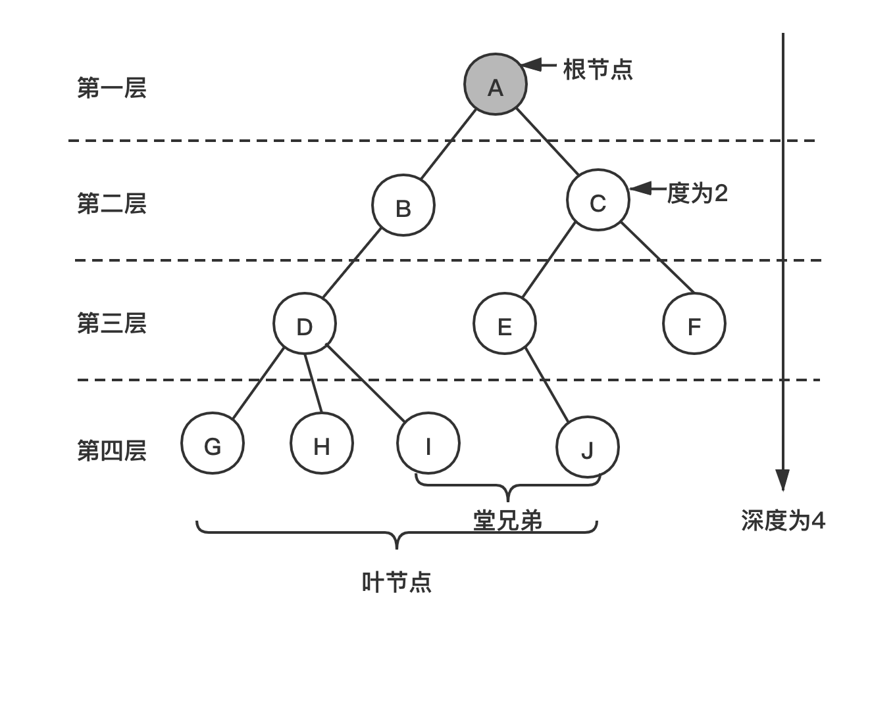
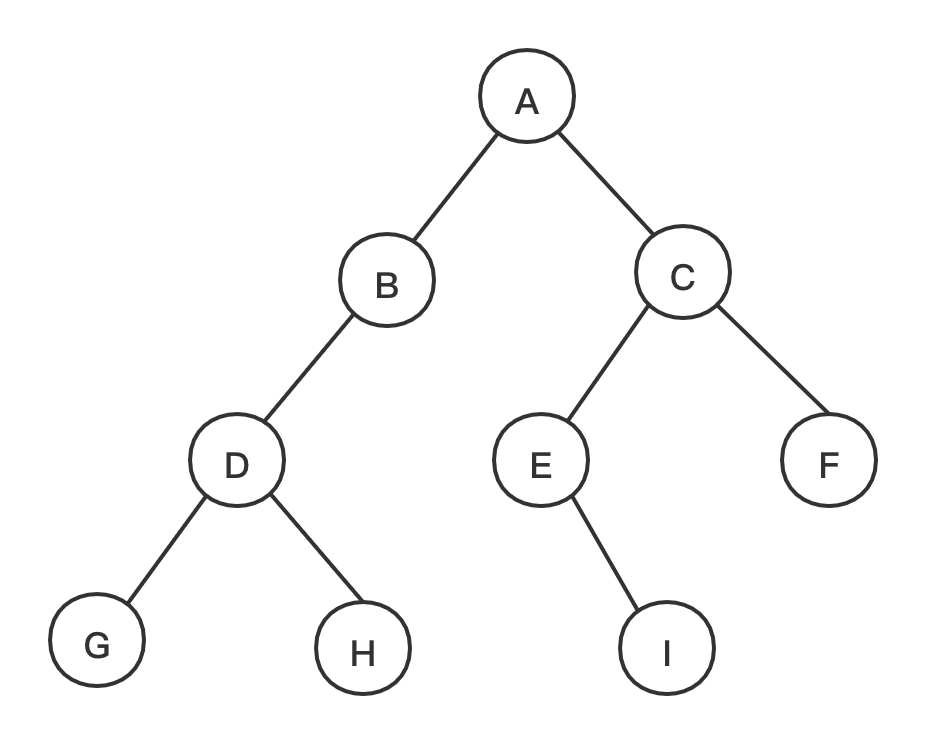

## 树

#### 树的定义
树(tree)是n(n>=0)个结点的有限集。n=0时称为空树。在任意一棵非空树中： 
- (1)有且仅有一个特定的称为根(root)的结点；
- (2)当n>1时，其余结点可分为m(m>0)个互不相交的有限集T1,T2,……,Tm,其中每一个集合本身又是一棵树，并且
称为根的子树(SubTree)。

相关概念：
- （1）**度**：结点拥有的子树数称为结点的度(degree)。度为0的结点称为叶结点(Leaf)或终端结点；度不为0的结点
称为分支结点或非终端结点。除根结点之外，分支结点也成为内部结点。树的度是树内各结点的度的最大值。
- （2）**关系**：结点的子树的根结点称为该结点的孩子(child)，相应的，该结点称为孩子的双亲(parent)。同一个双亲的孩子
之间称为兄弟(brother)。结点的祖先是从根到该结点所经分支上的所有结点。反之，以某结点为跟的子树中任一结点都称为该结点
的子孙。
- （3）**层次**：结点的层次(level)是从根开始定义起，根为第一层，根的孩子为第二层。双亲在同一层的结点互为堂兄弟。树中结点的最大层次
称为树的深度(depth)或高度。
- （4）**有序**：如果将树中的结点的各子树看成从左到右是有次序的，不能互换的，则称为该树为有序树，否则称为无序树。
- （5）**森林**：森林(forest)是m(m>=0)棵互不相交打的树的集合。

#### 二叉树
二叉树(Binary Tree)是n(n>=0)个结点的有限集合，该集合或者为空集(称为空二叉树),或者由一个根节点和两棵互不相交的，分别称为根结点的左子树
和右子树的二叉树组成。

特殊二叉树：
- 斜树:所有结点都只有左子树的二叉树叫左斜树。所有结点都是只有右子树的二叉树叫右斜树。这两者统称为斜树。
- 满二叉树:在一棵二叉树中，如果所有分支结点都存在左子树和右子树，并且所有叶子都在同一层上，这样的二叉树称为满二叉树。
- 完全二叉树:对一棵具有n个结点的二叉树按层序编号，如果编号为i(1<=i<=n)的结点与同样深度的满二叉树中编号为i的结点在
二叉树中位置完全相同，则这颗二叉树称为完全二叉树。

二叉树的性质：
- 1.在二叉树的第i层上至多有2^(i-1)个结点(i>=1)。
- 2.深度为k的二叉树至多有2^k-1个结点(k>=1)。
- 3.对任何一棵二叉树T，如果有终端结点数(叶子结点数)为n0,度为2的结点数为n2,则n0 = n2 + 1。

二叉树的遍历方法([code](code/tree/BinaryTree.java))：

- 1.**前序遍历** 若二叉树为空，则空操作返回，否则先访问根结点，然后前序遍历左子树，再前序遍历右子树。ABDGHCEIF
- 2.**中序遍历** 若二叉树为空，则空操作返回，否则从根结点开始，中序遍历根结点的左子树，然后访问根结点，最后中序遍历右子树。GDHBAEICF
- 3.**后序遍历** 若二叉树为空，则空操作返回，否则从左到右先叶子后结点的方式遍历访问左右子树，最后是访问根结点。GHDBIEFCA
- 4.**层次遍历** 若二叉树为空，则空操作返回，否则从树的第一层，也就是根结点开始访问，从上而下逐层遍历，在同一层中，按从左到右的顺序对结点逐个访问。ABCDEFGHI

线索二叉树：指向前驱和后继的指针称为线索，加上线索的二叉链表称为线索链表，相应的二叉树就称为线索二叉树。

二叉树的应用：
- 1.决策树
- 2.赫夫曼编码
